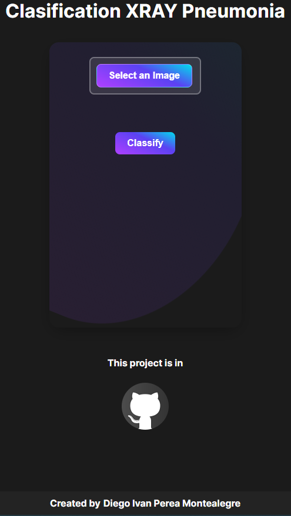
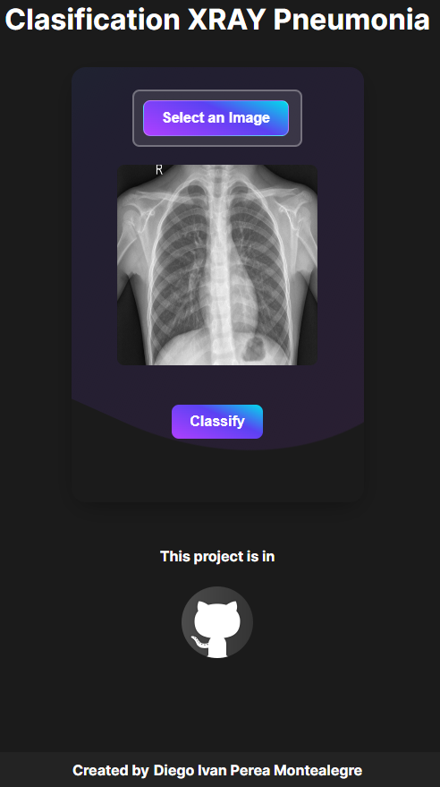
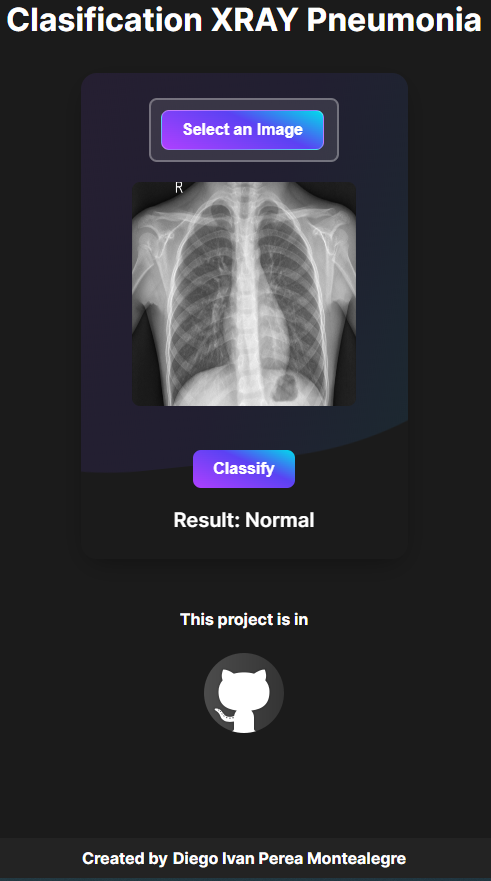
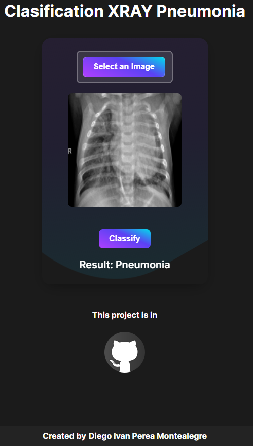
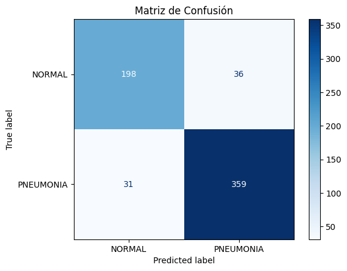
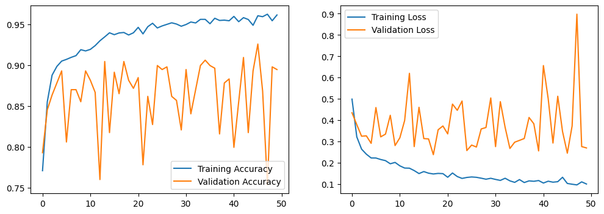

# Nextjs Clasification-X-ray-pneumonia

Nextjs Classification of chest x-ray images with pneumonia and normal using the [kaggle](https://www.kaggle.com/datasets/paultimothymooney/chest-xray-pneumonia) dataset [Chest X-Ray Images (Pneumonia)](https://www.kaggle.com/datasets/paultimothymooney/chest-xray-pneumonia), converting a.h5 model to tensorflowjs that is .json and .bin

Classification of chest x-ray images with pneumonia and normal using this pneumonia_classifier.h5 (file Copia_de_clasification_xray.ipynb) to convert it to tensorflowjs ,going from an h5 model to js produces several .bin files and the json model


<p align="center">
  
</p>

<p align="center">
  
</p>

<p align="center">
  
</p>

<p align="center">
  
</p>

----
Convert h5 to Tensorflowjs in ipynb
```bash
!pip install tensorflowjs
```
```bash
!tensorflowjs_converter --input_format keras /root/to/your/model.h5 /root/to/your/folder/save
```
-----
### Model results pneumonia_classifier.h5

<p align="justify">
The confusion matrix is observed 
</p>

<p align="center">
  
</p>

<p align="justify">
loss and accuracy are observed
</p>

<p align="center">
  
</p>

<p align="justify">
Evaluation
</p>

<p align="center">
  
</p>

-----

Install nextjs libraries tensorflow
```bash
npm install @tensorflow/tfjs @tensorflow/tfjs-backend-cpu @tensorflow/tfjs-backend-webgl
```
-----

Fronted Nextjs Options for do it:


This is a [Next.js](https://nextjs.org/) project bootstrapped with [`create-next-app`](https://github.com/vercel/next.js/tree/canary/packages/create-next-app).

## Getting Started
Nodejs version v20.10.0 and Next.js version v14.2.3 

First
```bash
npm install
```
run the development server:

```bash
npm run dev
# or
yarn dev
# or
pnpm dev
# or
bun dev
```

Open [http://localhost:3000](http://localhost:3000) with your browser to see the result.

## Resolve : Error Nextjs Parsing error: Cannot find module 'next/babel'

Put this code in .eslintrc.json 
```bash
{
  "extends": ["next/babel","next/core-web-vitals"]
}
```

Created by [Diego Ivan Perea Montealegre](https://github.com/diegoperea20)